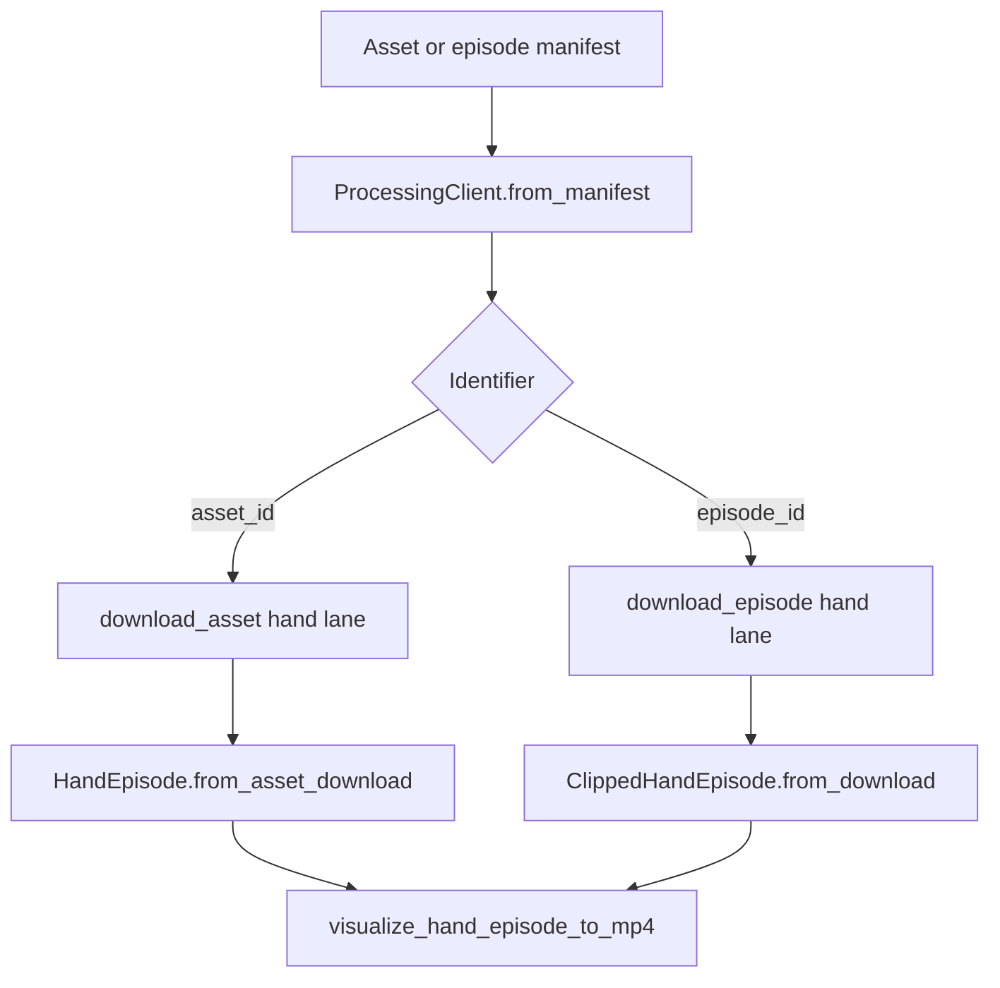

# Asset and episode flow

The SDK accepts either:

- an **asset manifest**, where `asset_id` identifies one full enriched segment; or
- an **episode manifest**, where `episode_id` identifies one captioned clip within a segment.

Both paths return a `HandEpisode`-compatible object and use the same visualizer.
No HTTP server is required when a manifest is supplied.

## Files and functions

| File | Function or class | Purpose |
| --- | --- | --- |
| `src/grounded/data/processing.py` | `ProcessingClient.from_manifest(...)` | Opens an asset or episode manifest. |
| `src/grounded/data/processing.py` | `download_asset(...)` | Downloads every available Hand, SLAM, and depth file for a full segment, or selected lanes. |
| `src/grounded/data/processing.py` | `download_episode(...)` | Downloads every available clipped lane for an episode, or one selected lane. |
| `src/grounded/data/processing.py` | `open_hand(...)` | Downloads and opens either a full Hand asset or a clipped Hand episode. |
| `src/grounded/data/ego_dataset.py` | `HandEpisode.from_asset_download(...)` | Safely extracts and opens a full-segment Hand archive. |
| `src/grounded/data/ego_dataset.py` | `ClippedHandEpisode.from_download(...)` | Opens the flat Hand files for one clipped episode. |
| `src/grounded/data/visualize_hand.py` | `visualize_hand_episode_to_mp4(...)` | Renders either reader to MP4. |
| `src/grounded/data/visualize_hand_3d.py` | `visualize_hand_episode_to_rerun(...)` | Renders either reader to a Rerun `.rrd` file. |

`processing.py` handles identity, manifest resolution, downloading, caching, and
integrity checks. `ego_dataset.py` turns downloaded Hand files into frame data
the visualizers can read.

## Control flow



An `asset_id` renders the entire enriched segment. An `episode_id` renders only
the producer-published clip and carries its caption.

## Quick validation

After installing the SDK from a wheel or source checkout:

```bash
python demo.py --manifest /path/to/manifest.json --episode 0
python demo.py \
  --manifest /path/to/manifest.json \
  --asset-id ast_v1_... \
  --cameras left_front \
  --downsample 4 \
  --num-workers 4
```

The demo downloads every available Hand, SLAM, and depth lane before rendering
Hand. Unavailable lanes are reported without placeholder files. It writes an
MP4 and Rerun `.rrd` file under `outputs/`, and reuses downloads cached under
`~/.cache/grounded/data`. Numeric episode indexes follow manifest row order.

The MP4 shows the camera grid with hand skeletons overlaid. The `.rrd` is
world-frame (gravity-aligned, +z up) when the SLAM lane is available: the
left-front camera and video plane follow the trajectory and the hands are
placed at their world positions; without SLAM it falls back to the camera
frame.

For a presigned manifest, no AWS credentials are required. For a manifest with
`s3://` file URIs, use the normal AWS credential chain or pass
`--aws-profile PROFILE`. Credentials are not stored in either manifest type.

Add `--allow-missing-sha256` only when validating a legacy manifest whose
producer did not publish checksums.

## Visualize a captioned episode

```python
from grounded.data.visualize_hand import visualize_hand_episode_to_mp4
from grounded.data.processing import ProcessingClient

client = ProcessingClient.from_manifest("episodes.json")
record = client.list_episodes()[0]
hand = client.open_hand(record.episode_id, active_cameras=["left_front"])

try:
    visualize_hand_episode_to_mp4(
        hand,
        "episode.mp4",
        caption=hand.caption,
    )
finally:
    hand.close()
```

## Visualize a full segment

```python
from grounded.data.visualize_hand import visualize_hand_episode_to_mp4
from grounded.data.processing import ProcessingClient

asset_id = "ast_v1_..."
client = ProcessingClient.from_manifest("assets.json")
hand = client.open_hand(asset_id, active_cameras=["left_front"])

try:
    visualize_hand_episode_to_mp4(hand, "full-segment.mp4")
finally:
    hand.close()
```

## Download all enrichment lanes

```python
# Every available full-segment lane.
asset_download = client.download_asset(asset_id)

# Every available clipped lane. Unavailable lanes remain visible in
# episode_download.lanes without fake files.
episode_download = client.download_episode(record.episode_id)
```

Pass `lanes=["hand"]` to `download_asset(...)` or `lane="hand"` to
`download_episode(...)` when only one lane is needed.
